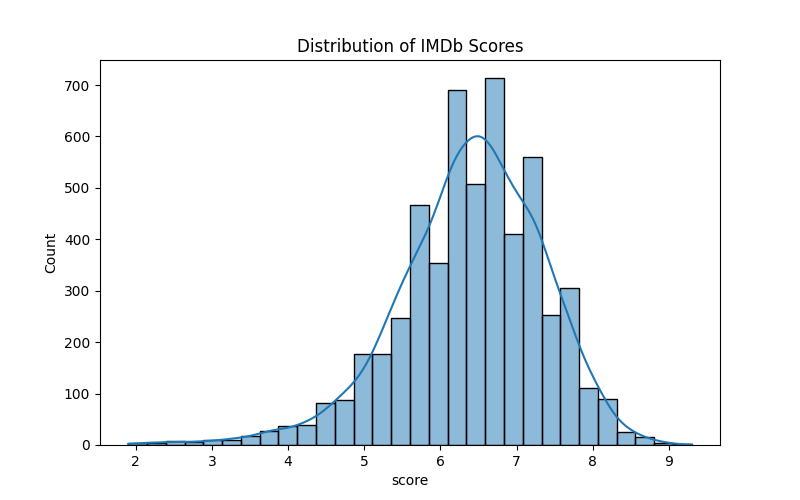
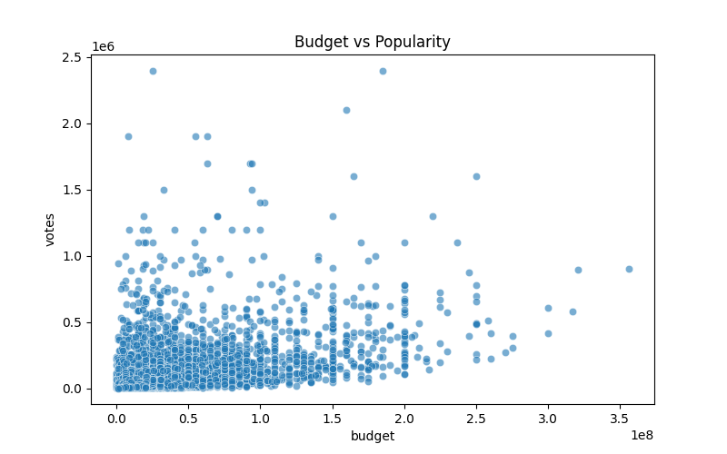
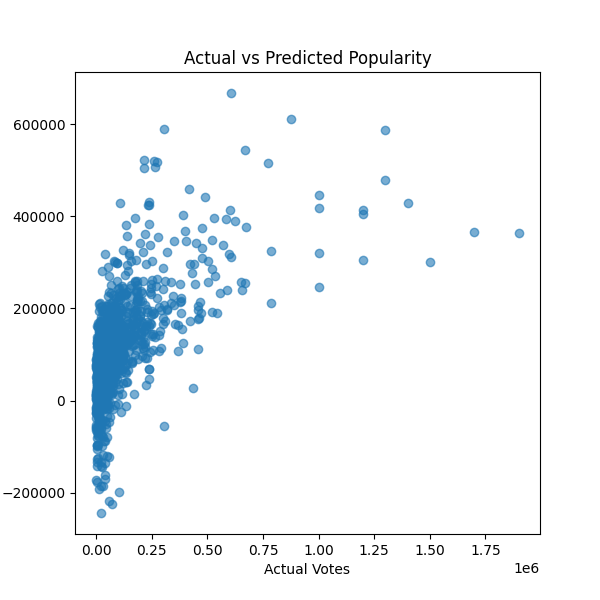

# DSA-210project
Project Overview & Motivation

The film industry has long been one of the most powerful and influential sectors in global entertainment. Every year, thousands of movies are released, yet only some of them manage to capture widespread audience attention and achieve lasting popularity. Understanding why certain movies become more popular than others is valuable not only for viewers, but also for producers, marketers, and analysts.

This project was developed to explore the main factors that influence a movie’s popularity between 1980 and 2020. In particular, it focuses on whether popularity is driven more by financial investment, audience ratings, or content related characteristics such as genre and runtime.

By using real world movie data, the project aims to uncover patterns behind audience behavior and measure which variables had the strongest impact on popularity over time.

Data Source: Where Did I Get This Data? 🌐

The primary dataset was obtained from Kaggle and contains detailed information about movies released over several decades. It includes financial, descriptive, and audience related variables that are suitable for statistical and predictive analysis.

The original dataset contains the following attributes:

Title
Genre
Release Year
IMDb Score
Number of Votes
Budget
Gross Revenue
Runtime
Country
Company

To improve the quality of the analysis, the dataset was further enriched using external information from IMDb. Movie titles and release years were used to match records and validate existing entries. This enrichment step allows more reliable comparisons and provides stronger support for the analysis.

After cleaning missing values, removing duplicates, and preparing the variables, the final dataset became ready for exploration.

Data Analysis: Techniques and Stages of Analysis 🔍

The project follows a structured analytical process consisting of multiple stages:

1. Data Cleaning and Preprocessing

Missing values, duplicates, and inconsistent records were handled. Relevant variables were selected, and data types were adjusted for analysis.

2. Exploratory Data Analysis (EDA)

Descriptive statistics and visualizations were used to understand the distributions of budget, popularity, ratings, revenue, and runtime.

3. Correlation Analysis

A correlation matrix was created to examine the relationships between numerical variables such as budget, votes, score, gross revenue, and runtime.

4. Hypothesis Testing

Statistical tests were applied to evaluate whether factors such as budget, ratings, genre, and runtime significantly influence popularity.

5. Predictive Modeling

Machine learning models such as Linear Regression, Random Forest Regressor, and K-Nearest Neighbors (KNN) were used to predict popularity using selected movie features.

6. Interpretation of Results

The final step focuses on interpreting findings and comparing which variables appear to be the strongest drivers of popularity.

Hypotheses to Test 📊
Budget and Popularity

Null Hypothesis (H0): Budget has no significant effect on movie popularity.
Alternative Hypothesis (H1): Higher budget movies tend to be more popular.

Ratings and Popularity

Null Hypothesis (H0): IMDb score has no significant effect on popularity.
Alternative Hypothesis (H1): Higher rated movies tend to be more popular.

Runtime and Popularity

Null Hypothesis (H0): Runtime has no significant relationship with popularity.
Alternative Hypothesis (H1): Runtime significantly affects popularity.

Genre Differences

Null Hypothesis (H0): Popularity does not differ between genres.
Alternative Hypothesis (H1): At least one genre differs significantly in popularity.

Popularity Prediction

Movie popularity can be predicted using budget, genre, runtime, and rating variables. Model performance will be evaluated using R² and Mean Squared Error (MSE).

Expected Results 📈

It is expected that financial investment and audience ratings will have positive effects on popularity. Movies with larger budgets may attract wider audiences through stronger marketing and production quality, while highly rated movies may gain popularity through positive audience reception and word of mouth.

It is also expected that some genres will perform better than others, depending on audience demand and market trends.

Overall, the results will help explain whether movie popularity depends more on money, quality, or content characteristics.

Tools & Technologies 🛠️
Python
Pandas
NumPy
Matplotlib
Seaborn
SciPy
Scikit-learn

## Machine Learning

A Linear Regression model was applied to predict movie popularity (measured by number of votes) using features such as budget, IMDb score, and runtime.

The model performance was evaluated using Mean Squared Error (MSE) and R² score.

- R² Score: ~0.36  
- MSE: 21143358032.67

The results indicate that the model is able to capture some of the variation in movie popularity, but not all. This suggests that while budget, score, and runtime have an influence, there are other important factors (such as marketing, cast, or release timing) that are not included in the model.

The scatter plot of actual vs predicted values shows that the model captures the general trend, but predictions are not highly accurate.

## Visualizations

### Score Distribution

### Budget vs Popularity

### ML Prediction (Actual vs Predicted)

## Conclusion

The analysis shows that both budget and IMDb score have a measurable impact on movie popularity. Hypothesis testing confirmed that high-budget movies tend to receive significantly more audience attention.

However, the machine learning model achieved only moderate performance (R² ≈ 0.36), indicating that popularity cannot be fully explained by the selected variables alone.

This suggests that external factors such as marketing strategies, star power, and release timing likely play an important role in determining a movie’s success.
